# qnd-papi-template

[](https://opensource.org/licenses/MIT)

A template repository to quickly spin up a Python API server with containerization support.

## 🛠 How to use this template

Simple click the **Use this template** button on the top-right corner of the GitHub repository page to create your own repository based on this template.

## 📋 Table of Contents

- [Features](#-features)
- [Prerequisites](#-prerequisites)
- [Getting Started](#-getting-started)
- [Docker Support](#-docker-support)
- [Usage](#-usage)
- [Contributing](#-contributing)
- [License](#-license)

## ✨ Features

- **🐍 Python-based API Server**: Built with Python for rapid development and deployment
- **🐳 Docker Ready**: Includes Dockerfile for easy containerization and deployment
- **⚡ Quick Setup**: Minimal configuration required to get started
- **🔧 Modular Architecture**: Clean project structure for easy customization
- **📦 Dependency Management**: Pre-configured dependency management with requirements.txt
- **🚀 Production Ready**: Configured for both development and production environments
- **🔄 CI/CD Friendly**: Provided with working GitHub Actions workflows for continuous integration and deployment

## GitHub Flow

This template provides working GitHub Actions workflows implementing the following GitHub Flow:



- Features are developed and merged into `dev` branch. CI workflow runs on every push.
- Once development is complete and tested, `dev` branch is merged into `release` branch for release preparation.
- Release workflow runs on every closed PR to `release` branch, performing tasks such as version bumping, building, testing, packaging, and publishing/deploying artifacts (if applicable).
- Finally, `release` branch is merged into `main` branch for baseline.

## 🤝 Contributing

We welcome contributions from the community! Here's how you can help:

### Reporting Issues

If you find a bug or have a suggestion:

1. **Search existing issues** to avoid duplicates
2. **Create a new issue** on GitHub:
   - Go to: https://github.com/btnguyen2k/qnd-papi-template/issues/new
   - Provide a clear title and description
   - Include steps to reproduce (for bugs)
   - Add relevant labels (bug, enhancement, question, etc.)

### Submitting Pull Requests

1. **Fork the repository** to your GitHub account

2. **Clone your fork** locally:
   ```bash
   git clone https://github.com/YOUR_USERNAME/qnd-papi-template.git
   cd qnd-papi-template
   ```

3. **Create a new branch** for your feature or fix:
   ```bash
   git checkout -b feature/your-feature-name
   # or
   git checkout -b fix/your-bug-fix
   ```

4. **Make your changes** following the project's coding standards

5. **Test your changes** thoroughly:
   ```bash
   # Run tests
   pytest
   
   # Run linters
   flake8 ./app
   black --check ./app
   ```

6. **Commit your changes** with clear, descriptive messages:
   ```bash
   git add .
   git commit -m "Add: brief description of your changes"
   ```

7. **Push to your fork**:
   ```bash
   git push origin feature/your-feature-name
   ```

8. **Create a Pull Request**:
   - Go to the original repository
   - Click "New Pull Request"
   - Select your fork and branch
   - Provide a clear title and description
   - Reference any related issues (e.g., "Fixes #123")

### Code Contribution Guidelines

- Follow [PEP 8](https://peps.python.org/pep-0008/) style guide for Python code
- Write clear, self-documenting code with appropriate comments
- Add unit tests for new features
- Update documentation as needed
- Ensure all tests pass before submitting PR
- Keep pull requests focused on a single feature or fix

## 📄 License

This project is licensed under the MIT License - see the [LICENSE.md](LICENSE.md) file for details.

## 🙏 Acknowledgments

- Thanks to all contributors who help improve this project
- Built with ❤️ by the community

## 📞 Contact & Support

- **Issues**: [GitHub Issues](https://github.com/btnguyen2k/qnd-papi-template/issues)
- **Discussions**: [GitHub Discussions](https://github.com/btnguyen2k/qnd-papi-template/discussions)

---

**Happy Coding! 🚀**
